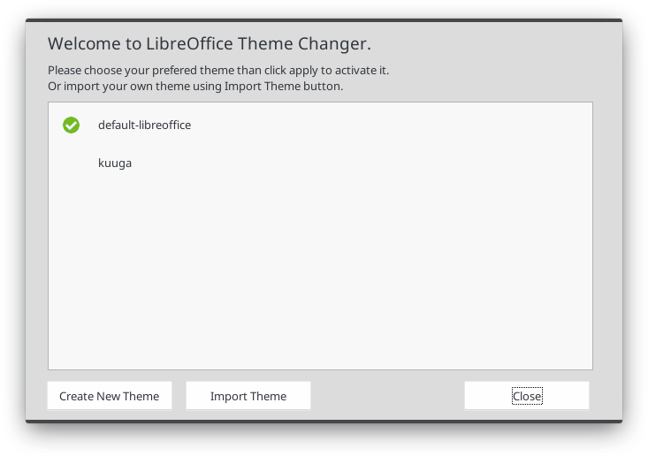
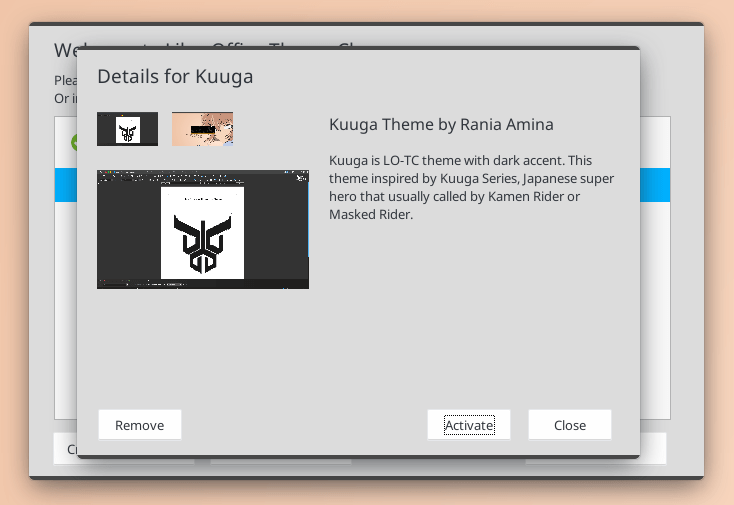
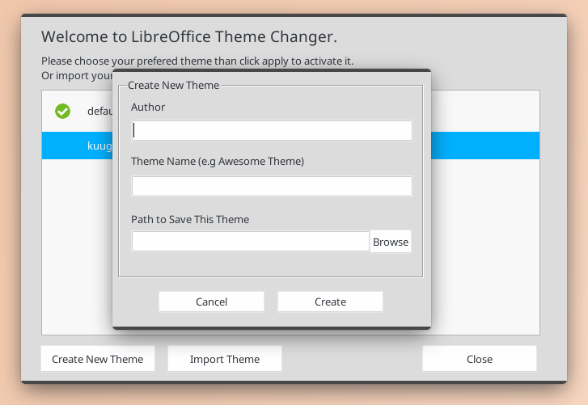
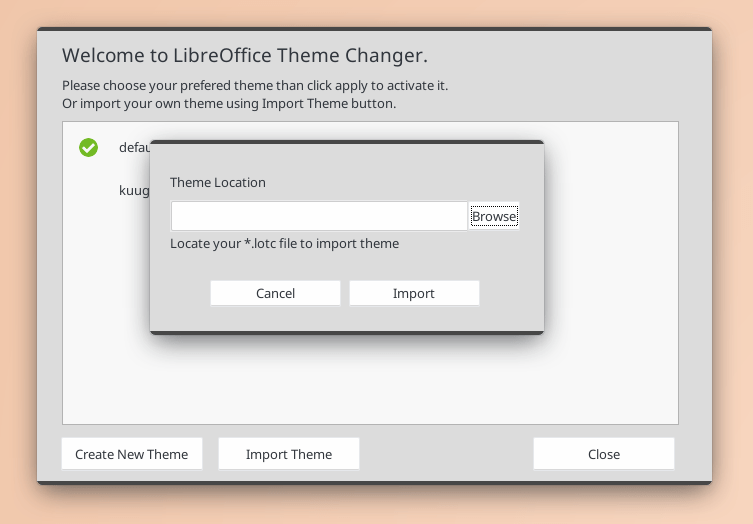

## LO-TC GUI
Extension to manage LibreOffice Theme. This extension is based on [LibreOffice Theme Changer](https://github.com/raniaamina/libreoffice-theme) by Rania Amina & Sofyan Sugianto.

## Target
- Starting Point
- [x] Wireframe and concept
- [x] UI Development

- Manage theme for LibreOffice 6.x
- [x] Import Theme (we will use \*.lotc as theme format)
- [ ] Apply theme to LibreOffice 6.x 
- [ ] Remove imported theme from LO-TC list
- [x] Create own theme

## How to use this extension
### Build Extension

To build LO-TC, just follow this steps:
```bash
# clone repository
git clone https://github.com/libreofficeid/LO-TC-GUI.git

# enter to clone directory 
cd LO-TC-GUI

# build extension
make zip
```

we have special command `make all` to everyone who wanna help us to develop this extension. This command used if you have make some update to python code, and wanna to show the update directly on your LibreOffice without re-install extension via Extension Manager. Just run `make all` then restart the LibreOffice.

### Extension Installation

Just like other extension, you only need to import this extension via menu: Tools -> Extension Manager, then add extension. LibreOffice should restart after new extension installation. 

For your information, at the first run, LO-TC will ask you for root permission to setup local environment. 

### LO-TC Interface



This is main dialog of LO-TC. All of imported theme will listed at white area. Green Mark indicate that the theme is active or used now. To see the details of each theme, just click the theme name, and detail of theme will appear. Look at picture.



Click Apply if you wanna apply this theme, or Remove to remove this theme from LO-TC list.

LO-TC can help you to creat your own theme. We use `*.lotc` as main format for LO-TC theme file. At the main dialog, click Create New Theme in order to start creating your own theme.

Please complete the required data as you see at this dialog, including Author Name, Theme Name, and path to save your directory theme.



Click Create button, to finish this step. Please go to path where your theme saved. Your next task is completing that directory so look like this tree. Don't forget to add several information about your theme into manifest.xml file.

``bash
theme-name
├── manifest.xml
├── personas
│   ├── theme-name
│   │   ├── footer.png
│   │   ├── header.png
│   │   └── preview.png
│   └── personas_list.txt
├── program
│   ├── intro.png
│   └── sofficerc
└── screenshots
    ├── screenshot-3.png
    ├── screenshot-2.png
    └── screenshot.png
```

We'll provide complete guide about step by step to create own LO-TC Theme in other post soon.

Let say your theme already finish, you can import your theme to LO-TC by clicking Import Theme.

, navigate the file manager to directory where the lotc file saved. If the import success, your new theme will listed in main dialog.

#### Current Support

The target of LO-TC Development mainly is for LibreOffice 6.2 or newer. LibreOffice available in various package or instalation method, especially for Linux. So, we make some priority stage.

- Linux
	- [x] Install from distro repository
	- [x] Install from DEB/RPM package (from web)
	- [x] Compile from source
	- [ ] Flatpak (on progress)
	- [ ] Snap
	- [ ] AppImage

- Mac OS
	- [ ] Mac OS

- Windows
	- [ ] Windows 8/8.1/10

## Disclaimer

We build LO-TC with love, but please remember to use it at your own risk. We are not responsible for the legality of the content (for example) that you use in the theme. All responsibilities are entirely held by each theme creator.

LO-TC works by changing some user settings, but the LO-TC developer does not store the user's private content at all. Any damage that occurs to the system caused by errors in the use of LO-TC (of course we never expect that), is entirely the responsibility of the user.

## Contribute to This Extension

We will be very happy if you are pleased to contribute to the development of LO-TC. The issue tab is open for everyone. Before open new issue,please make sure issue that will you open isn't exist before.

Don't hesitate to contact us if you have idea to bring LO-TC more better. LO-TC is developed by LibreOffice Indonesia Community (LibreOffice ID), currently we active on [Telegram](https://t.me/LibreOfficeID).
